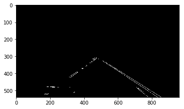
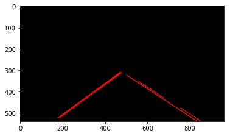
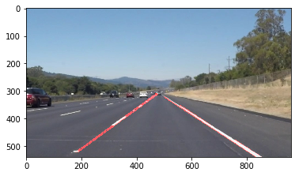

**Finding Lane Lines on the Road**

The goals / steps of this project are the following:
* Make a pipeline that finds lane lines on the road
* Reflect on your work in a written report

---

### Reflection

### Pipeline description

My pipeline consisted of 5 steps:
using the UNIX pipe notation:

input_image -> grayscale|gaussian_blur|canny|region_of_interest|
hough_lines|weighted_image -> output_image

Here are the intermediate steps of the pipeline:

Grayscale:

Canny and region mask (default params):

Canny and region mask (tuned):

Hough lines:

Annotated image:

I modified the draw_lines routine to separate the left lines from the right
lines based on their slope. Then I only draw the line with a slope bigger in
absolute value than the average slope of each set of lines.
I draw the left lines and the right lines separately.

Examples of output of the pipline on test images are provided in the
test_images_output folder

### Shortcomings of the proposed pipline:
Fine tuning the different parameters of Guassion blur and the Hough algorithm is hard
and depends on the image being processed. There should be a way the dynamically change
the parameters based the current frame.
It's also sensitive to shadow line on the road. Especially lines whose shadow have have
a slope close the slope of the the lane lines.
The detected line should be averaged (using which method?) and extrapolated.

### Possible improvements

- A better region of interest.
- Processing the left side of the road and the right side separatly
